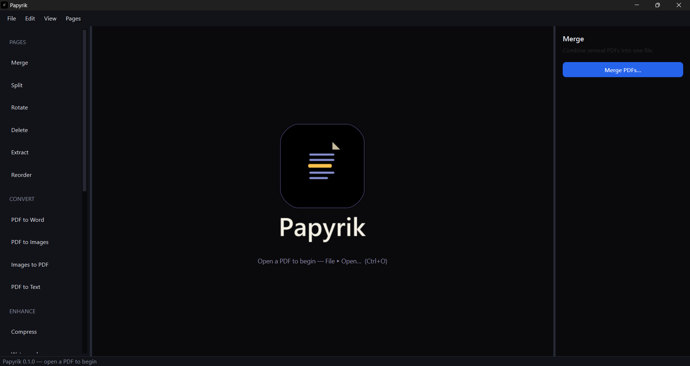
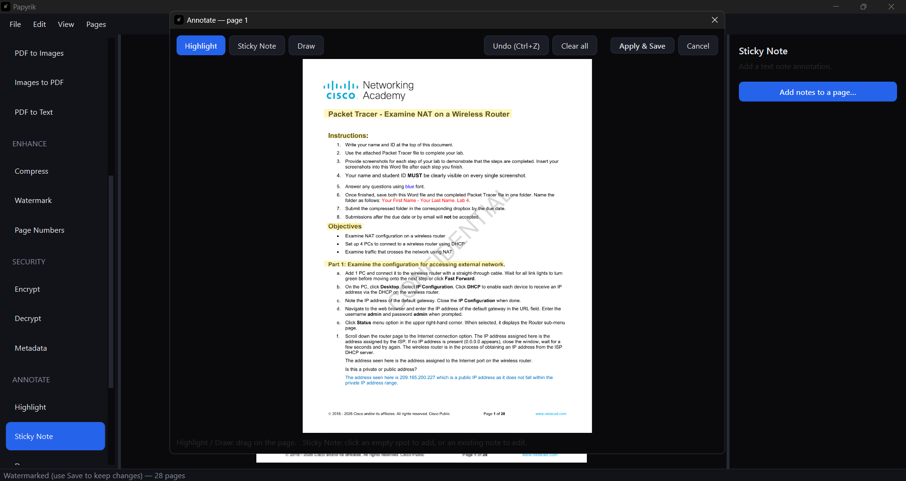
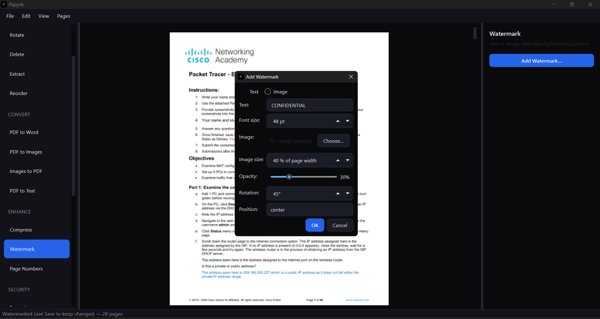
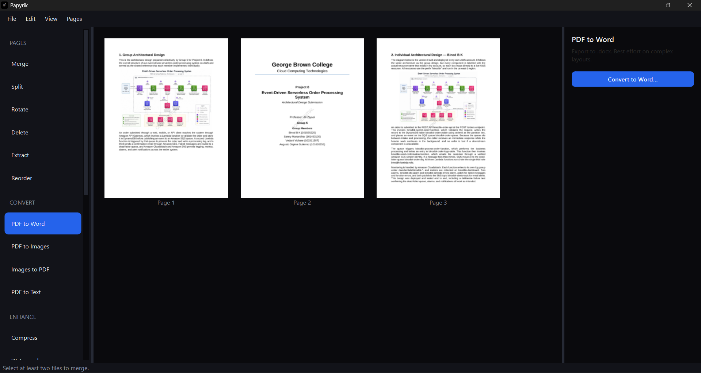
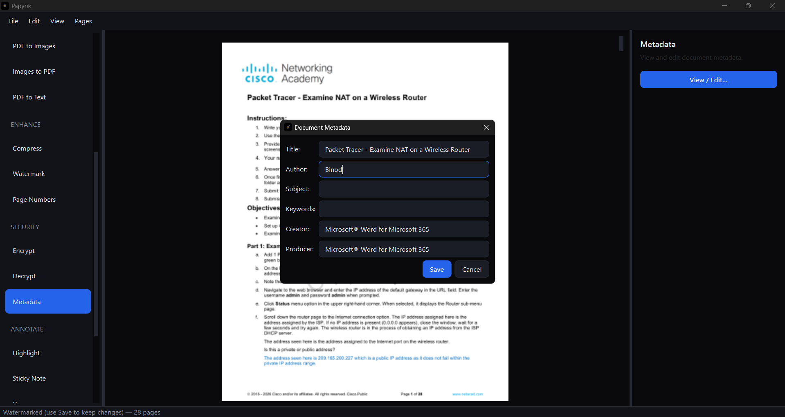

<p align="center">
  <picture>
    <source media="(prefers-color-scheme: dark)" srcset="assets/stacked-dark.png">
    
  </picture>
</p>

**An offline desktop PDF toolkit.** Everything iLovePDF / Smallpdf do — merge, split, convert, compress, watermark, encrypt, annotate, fill forms — but **100% local**: no upload, no file-size cap, no daily limit, no account. Your documents never leave your machine.

- **Platform:** Windows (desktop)
- **Stack:** Python 3.11+ · PyQt6 · PyMuPDF · pypdf · pdf2docx · Pillow
- **Status:** 145 automated tests passing

---

## Screenshots

<p align="center">
  
</p>

<table>
<tr>
<td width="50%"><br><sub>Annotate — highlight (multiple colours), sticky note, draw</sub></td>
<td width="50%"><br><sub>Watermark — text or image, opacity, rotation, size, position</sub></td>
</tr>
<tr>
<td width="50%"><br><sub>Convert — PDF to Word, Images, or Text</sub></td>
<td width="50%"><br><sub>Metadata — view and edit document info</sub></td>
</tr>
</table>

---

## Why Papyrik

Online PDF tools are convenient until you have a confidential contract, a 300-page report, or a file bigger than the free tier allows. Papyrik runs entirely on your computer:

- **Private** — files are processed locally and never uploaded.
- **No limits** — no size caps, no "3 files per day."
- **Non-destructive** — operations write to a new version; your original is never overwritten unless you explicitly **Save** over it.

---

## Installation

### Option A — run the built executable (no Python needed)

Download / build `dist/Papyrik.exe` (see [Building](#building-the-executable)) and double-click it. It runs on a clean Windows machine with no Python installed.

### Option B — run from source

```bash
git clone https://github.com/Binod-Bk/Papyrik.git
cd Papyrik
python -m venv .venv
.\.venv\Scripts\Activate.ps1
pip install -r requirements.txt
python -m papyrik.main
```

---

## The interface

Papyrik is a three-pane window:

- **Left — tool sidebar:** every operation, grouped (Pages, Convert, Enhance, Security, Annotate, Forms, Batch).
- **Center — page grid:** thumbnails of the open document. Multi-select, drag-to-reorder, right-click for page actions, double-click to open a page full-size.
- **Right — tool panel:** shows the selected tool and its action button.

Long operations run on a background thread, so the window never freezes, and each edit becomes a new **version** you can **Undo** (Ctrl+Z).

---

## Features

### Pages

| Feature | What it does |
| --- | --- |
| **Merge** | Combine several PDFs into one (File ▸ Merge PDFs…). |
| **Split** | Split every N pages into separate files (Pages ▸ Split…). |
| **Rotate** | Rotate selected pages 90° / 180° (right-click a page). |
| **Delete** | Remove selected pages (right-click ▸ Delete). |
| **Extract** | Save selected pages as a new PDF (right-click ▸ Extract). |
| **Reorder** | Drag pages in the grid, use **Ctrl+←/→**, or right-click ▸ Move left/right. |
| **Undo** | Every page edit is undoable with **Ctrl+Z**. |
| **Page viewer** | Double-click a page for a large view with zoom (50–300%) and prev/next. Click a sticky-note icon to read its text. |

### Convert

| Feature | What it does |
| --- | --- |
| **PDF → Word** | Export to `.docx` (best effort on complex/multi-column layouts). |
| **PDF → Images** | Render each page to PNG or JPEG. |
| **Images → PDF** | Combine image files into a single PDF, one per page. |
| **PDF → Text** | Extract the text layer to a `.txt` file. Warns clearly when a PDF is scanned/image-only (no text to extract). |

### Enhance

| Feature | What it does |
| --- | --- |
| **Compress** | Reduce file size with three presets (high / balanced / low). Re-encodes images while **preserving transparency**; text-only PDFs are already small. |
| **Watermark** | Stamp a **text** or **image** watermark on every page, with adjustable opacity, rotation, size, and 9-grid position. |
| **Page numbers** | Stamp page numbers with a custom start value and position. |

### Security

| Feature | What it does |
| --- | --- |
| **Encrypt** | Password-protect a PDF with AES-256. |
| **Decrypt** | Remove a known password (standalone — pick any protected file). |

### Metadata

**View / edit** the document's Info fields — title, author, subject, keywords, creator, producer.

### Annotate

| Feature | What it does |
| --- | --- |
| **Highlight** | Drag a box to highlight a region, in your choice of colour (yellow, green, pink, blue, orange). |
| **Sticky note** | Click to drop a note and type its text; click an existing note to read/edit it. Read notes anywhere via the page viewer. |
| **Draw** | Freehand ink with the mouse. |

The annotation window fits the page to the window, supports **Undo (Ctrl+Z)**, and applies your whole session as one undoable edit.

### Forms

**Fill Form** — fill existing AcroForm fields (text boxes, checkboxes, dropdowns) with a simple dialog pre-filled with current values. (Papyrik fills existing forms; it does not create new ones.)

### Batch

**Batch Folder** — apply one operation to **every PDF in a folder**: Compress, Watermark, Page numbers, Encrypt, Decrypt, PDF → Word, or PDF → Text. Shows a progress bar and a per-file results log. One bad file (corrupt or password-protected) is reported and skipped without aborting the run.

### Saving

- **Save (Ctrl+S)** overwrites the file you opened (written atomically, so a crash can't truncate your original).
- **Save As (Ctrl+Shift+S)** writes a copy.
- Closing with unsaved edits prompts **Save / Discard / Cancel**.

---

## Building the executable

```bash
pip install -r requirements.txt
pyinstaller papyrik.spec
```

Produces a standalone `dist/Papyrik.exe`. The [`papyrik.spec`](papyrik.spec) collects the data files and dynamic submodules of PyMuPDF, pdf2docx, and cryptography that PyInstaller would otherwise miss.

---

## Architecture

```
papyrik/
  main.py              # entry point
  workers.py           # QThread wrappers — no long op on the UI thread
  ui/
    main_window.py     # three-pane shell + operation dispatch
    thumbnail_view.py  # page grid: multi-select, drag-reorder, context menu
    tool_panel.py      # right-hand panel
    page_viewer.py     # full-page viewer + note reading
    annotation_view.py # interactive annotation canvas
    *_dialog.py        # watermark / metadata / form / batch dialogs
  core/                # pure PDF logic — never imports from ui/
    document.py        # PdfDocument wrapper (open, render, notes, save)
    batch.py           # apply an operation across a folder
    operations/        # one module per group, all pure functions
      pages.py convert.py security.py enhance.py annotate.py forms.py
```

**Design rules:** `core/` never imports `ui/`; every operation is a pure function (paths + params in, a path out) that's testable without a GUI; operations never mutate the input file; every long operation runs off the UI thread.

---

## Testing

```bash
pip install -r requirements-dev.txt
$env:QT_QPA_PLATFORM="offscreen"   # run Qt headless
python -m pytest tests -q
```

The suite (140 tests) runs every operation against a six-file corpus generated by [`tests/make_fixtures.py`](tests/make_fixtures.py): a scanned/image-only doc, a 300-page file, a fillable form, an AES-256 encrypted file, a CJK-text file, and a deliberately corrupt file — the cases where real PDF tools break.

---

## Non-goals & known limitations

- **No true text editing** — a PDF stores positioned glyphs, not paragraphs; reflow editing is out of scope.
- **No OCR** — scanned/image-only PDFs have no text layer to extract or search.
- **PDF → Word is best-effort** — simple layouts convert well; multi-column pages and tables may be imperfect.
- **Watermarks and page numbers are stamped in** — once saved, they're part of the page (keep a clean master; re-apply rather than "remove").
- **Annotations are add-only for now** — you can add and (in-session) undo them; editing existing annotations after reopening is a planned enhancement.

See [`docs/IDEAS.md`](docs/IDEAS.md) for planned post-launch features (annotation editing, smart page-number detection/removal).

---

## License

Papyrik is licensed under the **GNU Affero General Public License v3.0** — see [`LICENSE`](LICENSE).

Papyrik bundles [PyMuPDF](https://pymupdf.readthedocs.io/), which is itself AGPL-3.0 (or available under a commercial license from Artifex). Because the distributed build includes PyMuPDF, the combined work is governed by the AGPL — closed-source or paid distribution would require a commercial PyMuPDF license.
